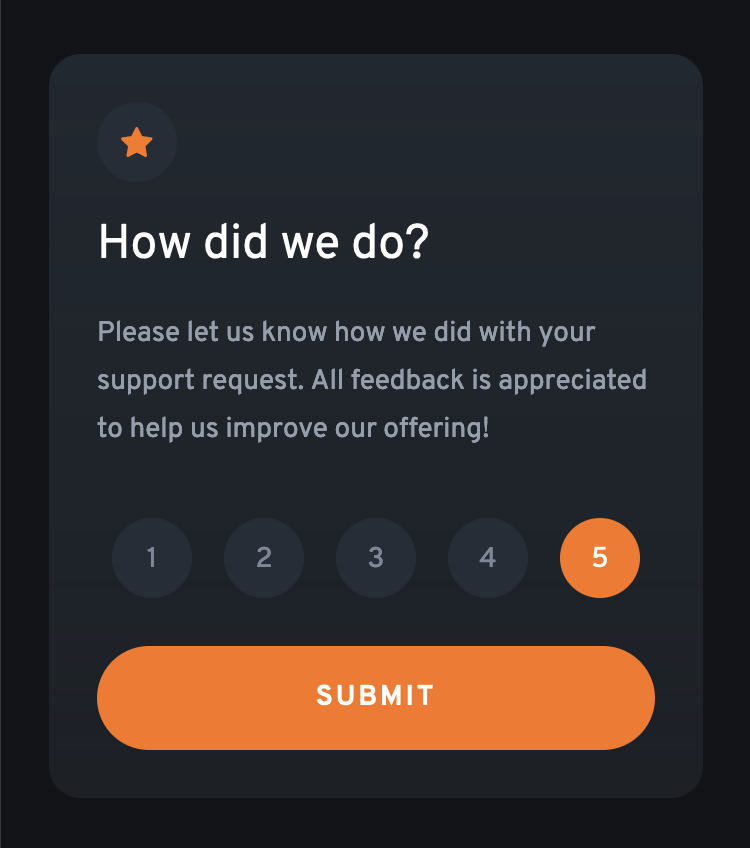
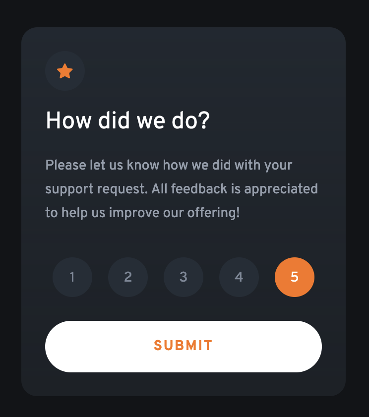

# Interactive Rating Component
Implementation of [Interactive Rating Component](https://www.frontendmentor.io/challenges/interactive-rating-component-koxpeBUmI) using Vue and TailwindCSS. Below is a high-level overview of the application flow. 

## Initial State - No Rating Selected
The app loads with a blank rating screen and no rating options selected. 
The submission button is also greyed out and non-clickable. When a rating is hovered over, the option
is highlighted in a lighter gray color. 


## Middle State - Rating Selected
Once a rating has been selected, its background changes
to orange and the submit button becomes active. Once the
button is active, hovering over it changes it to an active style. 




## Final State - Rating Submitted
Once the submit button has been clicked, rating card transitions out using a slide and fade into the thank-you card, with the user's rating in the card callout. 


## Technical Considerations
There are a few callouts we would like to make in implementing this application that could be helpful for people reviewing the code or trying to do it themselves. 

### Bespoke Styling
At the start of the project, we encoded the style-guide into the Tailwind theme, which improved the developer experience and exposed only colors and fonts which we needed in the project, in addition to a custom breakpoint for the desktop resolution. 


```
theme: {
    screens: {
      desktop: '1440px'
    },
    colors: {
      orange: 'hsl(25, 97%, 53%)',
      white: 'hsl(0, 0%, 100%)',
      'light-grey': 'hsl(217, 12%, 63%)',
      'medium-grey': 'hsl(216, 12%, 54%)',
      'dark-blue': 'hsl(213, 19%, 18%)',
      'very-dark-blue': 'hsl(216, 12%, 8%)'
    },
    fontFamily: {
      'overpass': 'Overpass, sans-serif'
    },
    extend: {},
},
```

### State Management
We use sum types to describe the possible states of the application, which helps eliminate bugs. These states have corresponding handlers which used by emitters to modify the application state. We use the [ts-pattern](https://github.com/gvergnaud/ts-pattern) library to emulate pattern-matching so we don't have dangling conditional statements when checking application state. 

```
export type SubmissionState 
    = { kind: 'not-rated' }
    | { kind: 'rated', rating: number }

...

const submissionState = ref({ kind: 'not-rated' } as SubmissionState)

const toggleRating = (rating: number): void => {
    submissionState.value = { kind: 'rated', rating }
}

const isRatingSelected = (ratingOption: number, state: SubmissionState): boolean => {
    return match(state)
        .with({kind: 'not-rated'}, () => false)
        .with({kind: 'rated', rating: P.select()}, (r) => r == ratingOption)
        .exhaustive()
}

const isReadyToSubmit = (state: SubmissionState): boolean => {
    return state.kind == 'rated'
}

const emit = defineEmits(['submitRating'])

const handleSubmission = (state: SubmissionState): void => {
    if (state.kind == 'rated')  {
        console.log('Submitted: ' + state.rating )
        emit('submitRating', state.rating)
    }
}
```

### Top-Level Component
The card transitions are managed in `src/App.vue`, where the top-level application state is managed. Even though the `SubmitCard` component also has a "copy" of the application state, once it emits its submission event the state is regenerated in the top-level `App` component. We choose this design so `SubmitCard` does not explicitly deal with a "terminated" or "completed" rating state, which doesn't make sense. 

```
  <Transition name="slide-fade">
    <SubmitCard 
        v-if="submissionState.kind == 'not-rated'"
        @submit-rating="toggleRating"
    ></SubmitCard>
    <ThankYouCard v-else :rating="submissionState.rating"></ThankYouCard>
  </Transition>
```